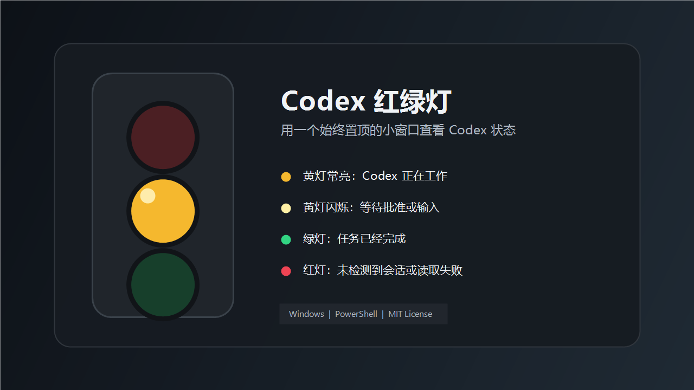

# Codex 红绿灯

一个适用于 Codex Desktop 的 Windows 桌面状态灯。它会显示在桌面右上角并保持置顶，让你不用反复切回 Codex 窗口，也能知道任务正在运行、等待批准，还是已经完成。



[English](README.md)

## 状态说明

- 黄灯常亮：Codex 正在工作。
- 黄灯闪烁：Codex 正在等待命令批准或用户输入。
- 绿灯：当前观察到的 Codex 任务均已完成。
- 红灯：没有检测到可读取的 Codex 会话，或状态读取失败。

## 运行要求

- Windows 10 或更高版本
- Windows PowerShell 5.1
- Codex Desktop

## 下载

使用 Git 克隆仓库：

```powershell
git clone https://github.com/taoyueping/codex-traffic-light.git
cd codex-traffic-light
```

也可以在 GitHub 仓库页面选择 **Code > Download ZIP**，解压后进入项目目录。

## 启动和关闭

启动红绿灯：

```powershell
powershell.exe -NoProfile -ExecutionPolicy Bypass -File .\scripts\start-traffic-light.ps1
```

关闭红绿灯：

```powershell
powershell.exe -NoProfile -ExecutionPolicy Bypass -File .\scripts\stop-traffic-light.ps1
```

窗口支持以下操作：

- 按住鼠标左键拖动窗口。
- 右键打开菜单。
- 取消 **Always on top** 可以关闭始终置顶。
- 选择 **Exit** 可以退出程序。

## 开机自启

启用登录后自动启动：

```powershell
powershell.exe -NoProfile -ExecutionPolicy Bypass -File .\scripts\install-startup.ps1
```

取消自动启动：

```powershell
powershell.exe -NoProfile -ExecutionPolicy Bypass -File .\scripts\uninstall-startup.ps1
```

## 查看当前状态

不打开窗口，只输出程序推断出的状态：

```powershell
powershell.exe -NoProfile -ExecutionPolicy Bypass -File .\scripts\CodexTrafficLight.ps1 -Probe
```

输出示例：

```json
{"State":"working","Label":"Codex working","ActiveCount":1,"ApprovalCount":0,"SessionCount":1}
```

## 工作原理与隐私

程序只读取 `%CODEX_HOME%\sessions` 下的 Codex JSONL 会话文件，并根据最近的用户消息、工具调用、批准请求和最终回复推断状态。

它不会：

- 修改或删除 Codex 会话。
- 自动批准命令。
- 向 Codex 发送消息。
- 将会话内容上传到网络。

状态是根据本地日志推断的。在异常退出、旧会话没有最终回复或 Codex 日志格式发生变化时，显示结果可能存在短暂偏差。

## 运行测试

```powershell
powershell.exe -NoProfile -ExecutionPolicy Bypass -File .\tests\test-status-engine.ps1
```

测试成功时会输出：

```text
Status engine tests passed.
```

## 项目结构

- `scripts/CodexTrafficLight.ps1`：桌面窗口和灯光显示。
- `scripts/StatusEngine.ps1`：读取会话并推断状态。
- `scripts/start-traffic-light.ps1`：后台启动程序。
- `scripts/stop-traffic-light.ps1`：停止程序。
- `scripts/install-startup.ps1`：安装开机自启快捷方式。
- `tests/test-status-engine.ps1`：状态判断测试。

## 许可证

本项目使用 [MIT License](LICENSE)，可以自由使用、修改和分发。
